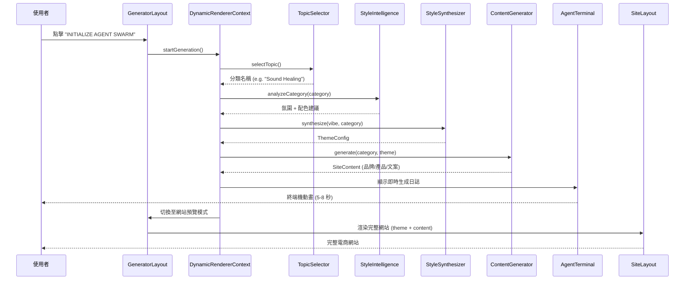
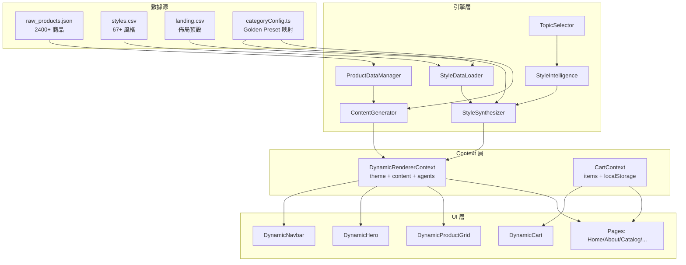
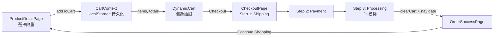

# ARCHITECTURE.md — 系統架構與核心邏輯流向

> 本文件描述 Universal Site Generator Prototype 的目錄結構、模組關係與數據流向。

---

## 目錄結構

```
site-generator-prototype/
├── public/                     # 靜態資源
├── src/
│   ├── main.tsx                # 應用入口
│   ├── App.tsx                 # 根組件（CartProvider + Router）
│   ├── index.css               # 全域 CSS（字體、捲軸、選取色）
│   ├── typings.d.ts            # 全域型別補丁（Framer Motion 兼容）
│   │
│   ├── engine/                 # ── 生成引擎（核心大腦）──
│   │   ├── TopicSelector.ts        # 隨機選取商品分類
│   │   ├── StyleIntelligence.ts    # 分類 → 氛圍語義映射
│   │   ├── StyleDataLoader.ts      # 解析 styles.csv / landing.csv
│   │   ├── StyleSynthesizer.ts     # 氛圍 → ThemeConfig 主題生成
│   │   ├── ContentGenerator.ts     # 生成品牌文案 / 產品列表 / 頁面內容
│   │   ├── ProductDataManager.ts   # 管理 raw_products.json (2400+ 商品)
│   │   └── PRDGenerator.ts         # 模擬 PRD 規格書生成
│   │
│   ├── context/                # ── React Context ──
│   │   ├── DynamicRendererContext.tsx  # 核心 orchestrator：Agent 模擬 + 主題 + 內容
│   │   └── CartContext.tsx            # 購物車狀態 + localStorage 持久化
│   │
│   ├── components/
│   │   ├── GeneratorLayout.tsx     # 頂層路由佈局（生成階段 vs 網站階段）
│   │   ├── dynamic/                # ── 主題感知動態組件 ──
│   │   │   ├── AgentTerminal.tsx       # 生成過程的終端機動畫
│   │   │   ├── DynamicNavbar.tsx       # 動態導航列（3 種風格變體）
│   │   │   ├── DynamicHero.tsx         # 動態 Hero 區塊（5+ 佈局）
│   │   │   ├── DynamicProductGrid.tsx  # 動態產品網格（瀑布流/輪播/網格）
│   │   │   └── DynamicCart.tsx         # 購物車側邊抽屜
│   │   ├── dashboard/
│   │   │   └── GodModePanel.tsx        # 開發者控制面板（切換預設主題）
│   │   └── layout/
│   │       └── SiteLayout.tsx          # 網站包裝器（Navbar + Footer + Cart 按鈕）
│   │
│   ├── pages/                  # ── 路由頁面 ──
│   │   ├── HomePage.tsx              # / — Hero + 產品展示
│   │   ├── AboutPage.tsx             # /about — 品牌故事
│   │   ├── CatalogPage.tsx           # /catalog — 完整產品目錄
│   │   ├── ContactPage.tsx           # /contact — 聯絡表單
│   │   ├── ProductDetailPage.tsx     # /product/:id — 商品詳情 + 加入購物車
│   │   ├── CheckoutPage.tsx          # /checkout — 三步驟結帳流程
│   │   └── OrderSuccessPage.tsx      # /order-success — 訂單確認頁
│   │
│   ├── types/                  # ── TypeScript 型別 ──
│   │   ├── Theme.ts                  # ThemeConfig (colors, typography, vibe...)
│   │   ├── Content.ts                # Product, SiteContent 介面
│   │   ├── AgentTeam.ts              # Agent 定義與技能列表
│   │   ├── StyleTypes.ts             # VibeType, ColorPalette 等風格型別
│   │   └── PRD.ts                    # PRD 規格書結構
│   │
│   ├── data/                   # ── 靜態數據資源 ──
│   │   ├── raw_products.json         # 真實產品數據 (2400+ 項, 103KB)
│   │   ├── styles.csv                # 67+ 風格定義 (96KB)
│   │   ├── landing.csv               # 落地頁佈局預設 (14KB)
│   │   ├── categoryConfig.ts         # 分類 → Golden Preset 映射
│   │   └── themePool.ts              # 備用主題池
│   │
│   └── lib/                    # ── 工具函式 ──
│       └── utils.ts                  # clsx + tailwind-merge 封裝
│
├── CLAUDE.md                   # 開發環境與規範
├── HANDOVER.md                 # 交接文件
├── ARCHITECTURE.md             # 本文件
├── package.json
├── tsconfig.app.json           # TypeScript strict 配置
├── vite.config.ts              # Vite + React + Tailwind 配置
└── eslint.config.js            # ESLint flat config
```

---

## 核心邏輯流向



---

## 數據流向



---

## 路由結構

```mermaid
graph LR
    R[BrowserRouter] --> GL[GeneratorLayout]
    GL -->|生成前| AT[AgentTerminal + 按鈕]
    GL -->|生成後| SL[SiteLayout]
    SL --> HP[/ HomePage]
    SL --> AB[/about AboutPage]
    SL --> CA[/catalog CatalogPage]
    SL --> CO[/contact ContactPage]
    SL --> PD[/product/:id ProductDetailPage]
    SL --> CK[/checkout CheckoutPage]
    SL --> OS[/order-success OrderSuccessPage]
```

---

## 主題系統架構

主題由 `ThemeConfig` 介面定義，包含：

| 屬性 | 用途 |
|---|---|
| `colors.primary / secondary / background / text / muted / accent` | 全站配色 |
| `typography.fontFamily / headingFont / fontSize / letterSpacing` | 字體系統 |
| `borderRadius` | 圓角半徑 |
| `shadowDepth` | 陰影深度 (none / sm / md / lg / xl) |
| `vibe` | 氛圍類型 (luxury / energetic / technology / corporate / street) |
| `cssVariables` | 動態 CSS 變數 (如 `--glass-opacity`) |

所有動態組件（`Dynamic*`）接收 `theme` prop，並透過 inline `style` 應用主題，確保每次生成都是視覺上獨一無二的。

---

## 購物車流程


